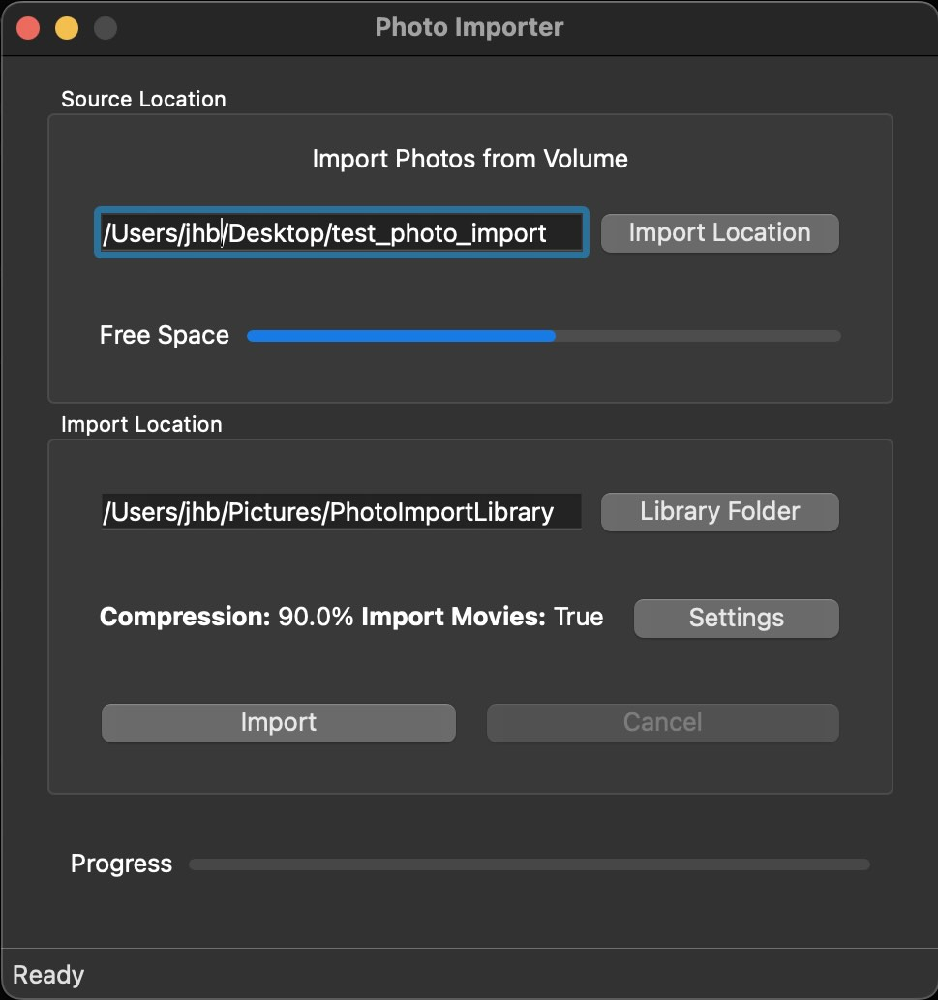

# Photo Importer
MacOs gui app for importing and organizing images from SD cards.

[Download Binary V1.0](https://github.com/jbartolozzi/PhotoImporter/blob/main/PhotoImporter.zip?raw=true)

 

# Development
To automatically set up environment and build run

```source ./setup.sh```

To manually run pyinstaller build run

```pyinstaller PhotoImporter.spec --noconfirm```


